## Hi there 👋
<picture>
  <source media="(prefers-color-scheme: dark)" srcset="dark.svg">
  <source media="(prefers-color-scheme: light)" srcset="light.svg">
  
</picture>
<!--
**vishalsharmazx3-design/vishalsharmazx3-design** is a ✨ _special_ ✨ repository because its `README.md` (this file) appears on your GitHub profile.

